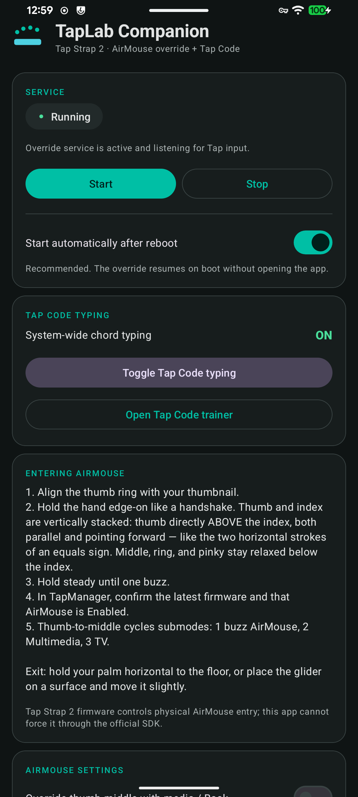
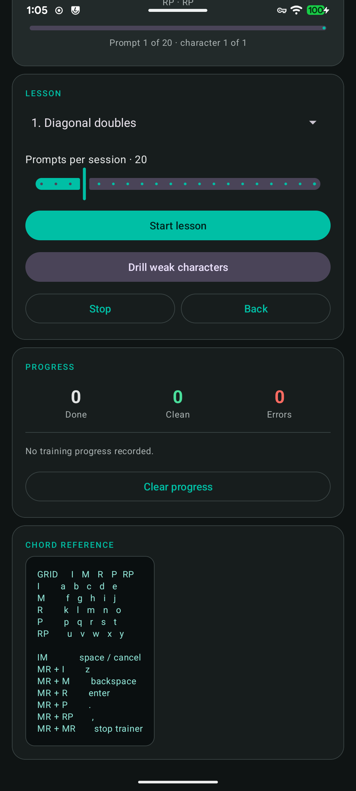
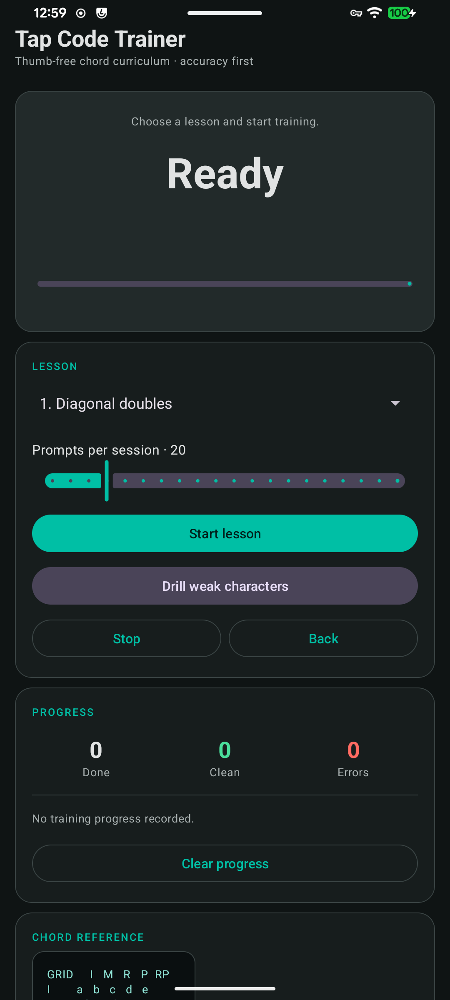

# TapLab

Tools for making the [Tap Strap 2](https://www.tapwithus.com/) genuinely usable as a daily driver.

The centerpiece is **TapLab Companion**, a native Android app that replaces the
Tap's stock typing with a high-accuracy chord system and fixes its AirMouse
gesture handling. A companion web dashboard for telemetry and remapping is also
included.

---

# TapLab Companion (Android)

System-wide **Thumb-Free Tap Code** typing plus a much more capable **AirMouse
override** for Tap Strap 2 on rooted Android.

| Main | Settings | Trainer |
| --- | --- | --- |
|  |  |  |

## Why

The stock Tap alphabet is one chord per character, which means many chords are
similar and mistakes are easy. Thumb-Free Tap Code instead uses **two chords per
character** drawn from only five simple symbols, so every character is a
fixed-length, high-contrast sequence. The thumb is left free, which keeps it
available for AirMouse gestures and clicks.

Separately, Tap Strap 2's AirMouse gives you a cursor but a thin set of
actions. The companion adds real clicks, right clicks, scrolling, media control,
and Back.

## Features

- **System-wide Tap Code typing.** Decoded characters are injected at the current
  input focus in any app, not just inside this one.
- **AirMouse gesture override.** Left click, right click, two-finger scrolling,
  and optional media/Back.
- **Native 10-lesson trainer.** Progressive curriculum with per-character
  accuracy tracking, live chord hints, and automatic weak-character drills. No
  browser, WebView, or Web Bluetooth needed.
- **Works from boot.** A foreground service starts automatically after reboot
  with Tap Code already enabled, so a fresh install is usable without opening
  the app.
- **Non-destructive.** Turning Tap Code off restores the Tap's stock text mode,
  and the native Multimedia/Smart TV profiles are left alone.
- **Persistent diagnostic log** for troubleshooting, surviving disconnects,
  restarts, and reboots.

## Requirements

- **Rooted** Android 10 or newer (Magisk root granted to the app)
- Tap Strap 2 paired at the Android OS level
- Bluetooth and notification permissions

Root is required because text injection uses Android's `input` command. There is
no non-root path for system-wide injection.

## Install

```bash
cd companion-android

# Windows
.\gradlew.bat assembleDebug

# macOS/Linux
./gradlew assembleDebug

adb install -r app/build/outputs/apk/debug/app-debug.apk
```

Requires JDK 17 and Android SDK 35. Open the app once to grant Bluetooth,
notification, and root permissions.

## Thumb-Free Tap Code

Two chords per letter: the first selects a row, the second selects a column.
Only five symbols are used — Index, Middle, Ring, Pinky, and Ring+Pinky.

| First \ Second | Index | Middle | Ring | Pinky | Ring+Pinky |
| --- | --- | --- | --- | --- | --- |
| **Index** | a | b | c | d | e |
| **Middle** | f | g | h | i | j |
| **Ring** | k | l | m | n | o |
| **Pinky** | p | q | r | s | t |
| **Ring+Pinky** | u | v | w | x | y |

Controls use two dedicated chords, Index+Middle (IM) and Middle+Ring (MR):

| Sequence | Action |
| --- | --- |
| IM | Space, or cancel an incomplete sequence |
| MR then Index | `z` |
| MR then Middle | Backspace |
| MR then Ring | Enter |
| MR then Pinky | `.` |
| MR then Ring+Pinky | `,` |
| MR then MR | Turn Tap Code off, back to the stock keyboard |

Incomplete sequences expire after 800 ms; expiry is recovery-only and never
types a character.

## AirMouse mapping

| Tap gesture | Action |
| --- | --- |
| Index-to-thumb single tap | Left click |
| Index-to-thumb double tap | Right click |
| Middle-to-thumb | Native profile cycle by default; media play/pause or Back optional |
| Two-finger swipe up/down | Scroll up/down |

Middle-to-thumb is deliberately left to the firmware's own one/two/three-buzz
AirMouse → Multimedia → Smart TV cycle by default, because overriding it
conflicts with that cycle. Every mapping and the double-tap window (150–500 ms,
default 275 ms) is configurable and applies live.

## Clicking without AirMouse

AirMouse gives you a cursor, but the pinch that clicks also nudges the cursor
off target. So clicks are available in the other two modes too.

**While typing (keyboard mode)**, chords containing the thumb are claimed as
gestures. Thumb-Free Tap Code never uses the thumb, so this can never collide
with text:

| Fingers in the chord | Example raw values | Action |
| --- | --- | --- |
| Thumb + Index (any extras) | 3, 7, 11, 19 | Left click |
| Thumb + Middle, no index | 5, 13, 21 | Media play/pause |
| Thumb alone, or thumb + ring/pinky only | 1, 9, 17, 25 | Ignored |

Matching is by finger bitmask rather than exact chord value, because pinching
thumb to index routinely co-triggers a neighbouring finger - the hardware
reports 7 or 11 far more often than a clean 3. An optional right-click double
tap is available with its own independent timing window.

**While using the optical glider (surface mouse)**, the firmware reports the
MULTIMEDIA state - the same state used when Multimedia is selected as a media
remote, so the two are indistinguishable to software. Opting into
**Treat Multimedia profile as surface mouse** reclaims it for cursor use:
index tap = left click, optional middle tap = right click, and Tap Code text
decoding is suspended so a bare index tap no longer starts a letter and then
times out. The trade-off is losing the native Multimedia media keys while
gliding, which is why it is off by default.

## Known limitations

- **AirMouse cannot be forced on.** Physical AirMouse entry is firmware and
  orientation controlled. The official SDK's XR state command is TapXR-only.
  The app documents the correct activation posture instead of pretending to
  force it.
- **Typing latency.** Injection goes through `input text`, so expect roughly
  200–300 ms per character.
- **Native profile cycling cannot be blocked.** A thumb-middle touch can make
  the firmware jump to Multimedia or Smart TV on its own. The app reports the
  transition and resumes afterwards, but cannot prevent it.
- **Stock keystrokes are not logged.** In stock TEXT mode the Tap sends HID
  keyboard output straight to Android with no SDK callback. Capturing those
  would require a keylogger, which this app intentionally does not implement.

**[Full companion documentation, settings reference, and troubleshooting →](companion-android/README.md)**

---

# TapLab Web

A browser dashboard for live chord telemetry and remap experiments over Web
Bluetooth. Useful for inspecting what the hardware is actually sending; not
required to use the Android app.

- Live BLE chord telemetry
- Chord drills with weak-chord targeting
- Thumb-Free Tap Code decoder and curriculum (the reference implementation the
  Android decoder was ported from)
- Lifetime progress in IndexedDB
- Fuzzy chord-correction engine

```bash
npm install
npm run dev
```

Open [https://localhost:5173](https://localhost:5173) in Chrome or Edge. Web
Bluetooth is required. The dev server binds to the LAN with self-signed HTTPS
via `@vitejs/plugin-basic-ssl`, so you can also reach it from a phone at
`https://<pc-ip>:5173` after accepting the certificate warning.

## Project structure

| Path | Purpose |
| --- | --- |
| `companion-android/` | **Native Android companion (main focus)** |
| `companion-android/tap-android-sdk/` | Vendored official TapWithUs Android SDK (Apache-2.0) |
| `src/core/` | Chord tables and shared types |
| `src/connection/` | BLE/GATT connection and Tap protocol handling |
| `src/tapcode/` | Thumb-Free Tap Code decoder, curriculum, drills, and tests |
| `src/trainer/` | Standard chord drill and training engine |
| `src/telemetry/` | Session statistics and IndexedDB persistence |
| `src/engine/` | Fuzzy remap engine |

## Testing

```bash
npm test                          # web suite (Vitest)

cd companion-android
./gradlew testDebugUnitTest       # Kotlin Tap Code decoder tests
```

## Hardware notes

The stock alphabet map used by the web dashboard is partially verified; three
codes remain pending hardware verification. See
[`src/core/chords.ts`](src/core/chords.ts). Thumb-Free Tap Code does not depend
on that map — it decodes raw chord bitmasks directly.

## License

MIT. The vendored TapWithUs Android SDK under `companion-android/tap-android-sdk/`
is Apache-2.0 and retains its own LICENSE file.
